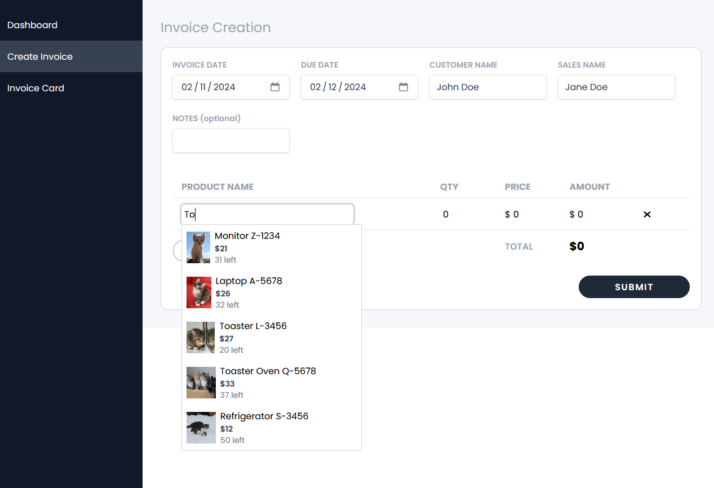
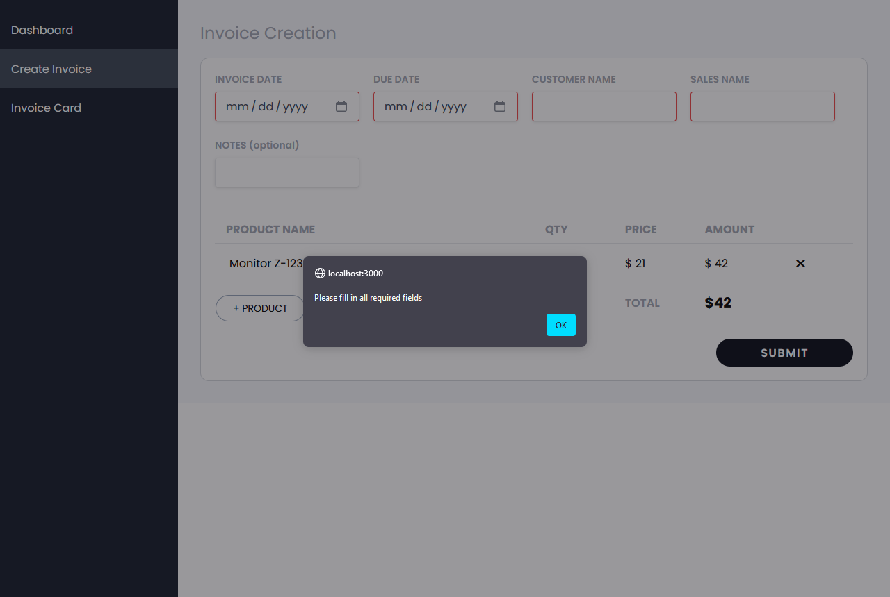
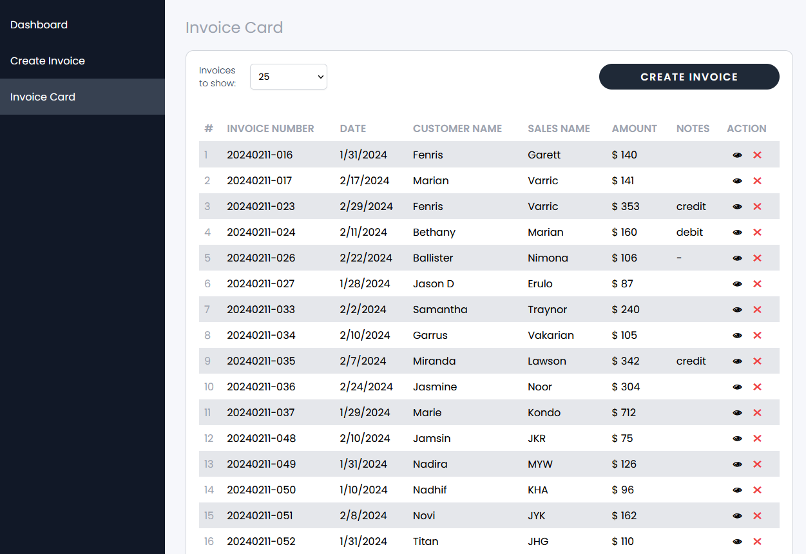
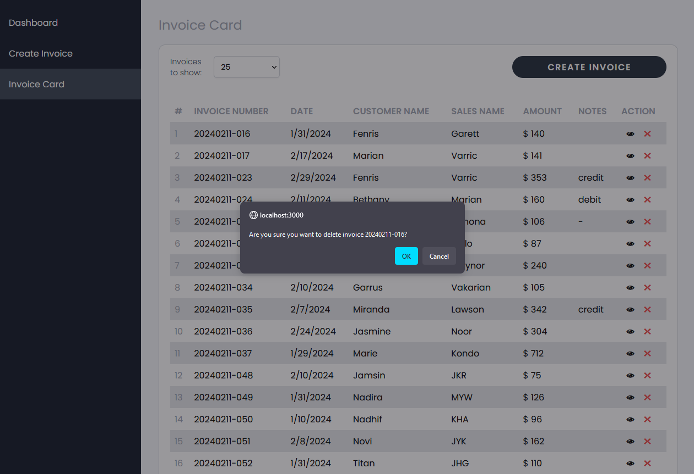
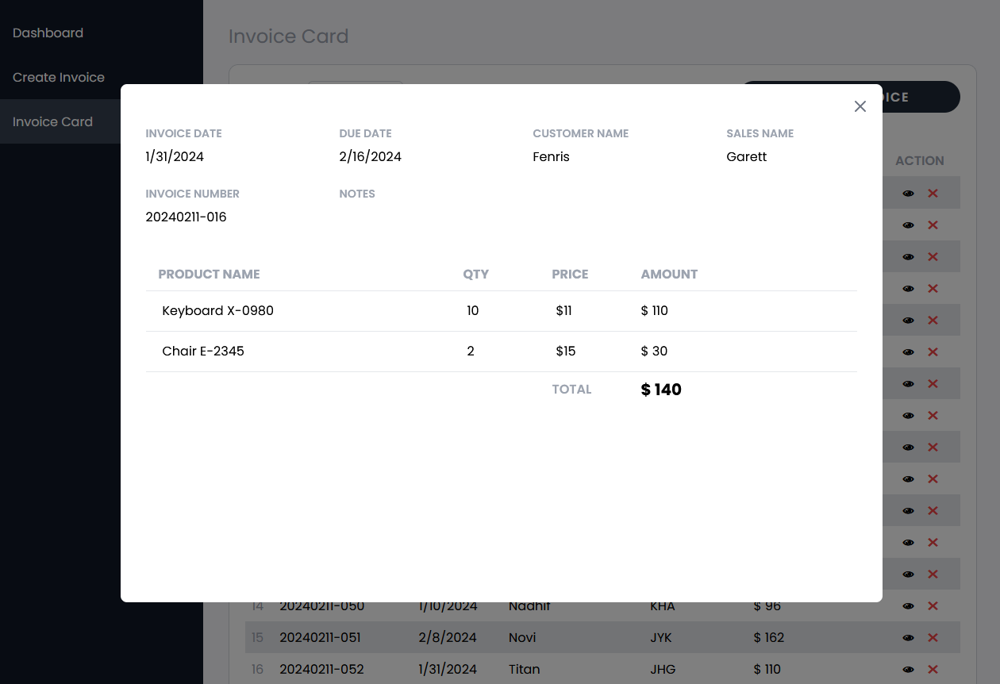
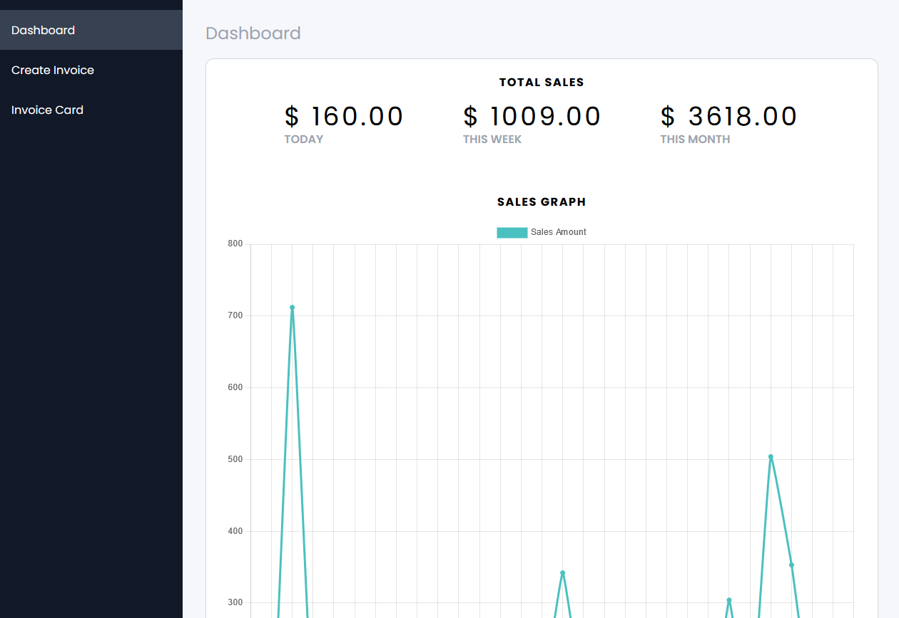
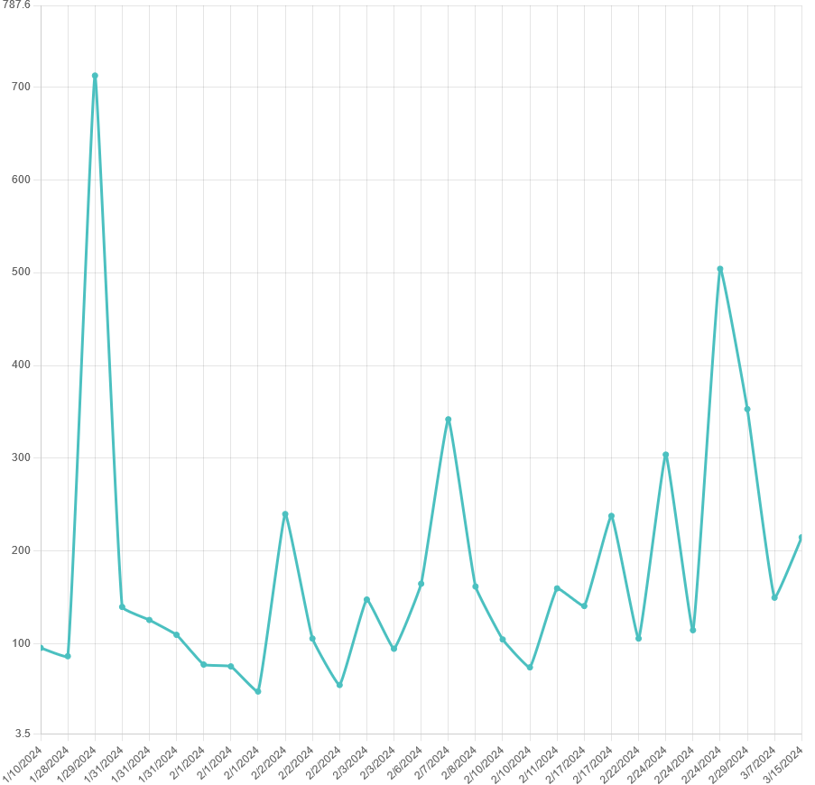
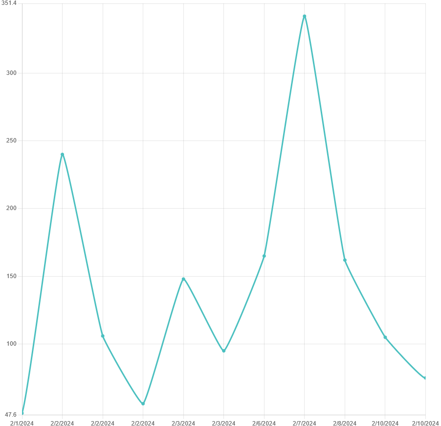

# Invoice System Demo

This system was developed as part of the technical test requirement for Wida Tech, using React.js, Node.js, Redux, and MySQL.

There are 3 pages in this system: 'Invoice Creation', 'Invoice Card', and 'Dashboard'.

## Invoice Creation
The 'Invoice Creation' page provides a comprehensive interface for users to create new invoices. Features include:

- Product Recommendations: As the user types in the product name, the system will suggest relevant products based on input.

- Automated Price Calculation: Upon defining the quantity of products in the invoice, the system will compute the total price of the selected item(s).
- Error Handling: If any mandatory fields (invoice date, invoice due date, customer name, and sales name) are left empty upon submission, an error message will prompt users to fill in the necessary fields before proceeding.

## Invoice Card
The 'Invoice Card' page is used to display all the invoices that had previously been created. Users can select how many invoices are displayed on one page.

Features include:
- Deletion: The user can delete previously created invoices by clicking on the ✖ button on the action column.

- Details: The user can see the details of previously made invoices by clicking the 👁 button on the action column.
  

## Dashboard
The 'Dashboard' page will show the stats of all of the invoices in the database. Features include:

- Total Sales: The system will show the total amount of sales from the invoices in the database, categorized by daily, weekly, and monthly periods.

- Chart: The page will render a line chart that represents the amount of sales taken from the invoices in the system.

The chart can be zoomed in and out to show the data in more detail.

